# Physarum Slime Mold Simulation

A biologically-inspired optimisation algorithm that simulates the foraging behaviour of _Physarum polycephalum_ (slime mold) to solve graph-based problems like the Minimum Spanning Tree.

## Demo Videos

|                                     MST optimisation                                      |                                      Dense Start Simulation                                       |                                       Agent Visualization                                        |
| :---------------------------------------------------------------------------------------: | :-----------------------------------------------------------------------------------------------: | :----------------------------------------------------------------------------------------------: |
| [](https://youtu.be/7ZkC3MxK37Q) | [](https://youtu.be/TFyH6HfQy6c) | [](https://youtu.be/dhvJkvUcZjE) |

## Results

### Minimum Spanning Tree Experiments

Evolution of network topology as the slime mold finds optimal connections between nodes.

|                         Step 1                         |                         Step 2                         |                         Step 3                         |
| :----------------------------------------------------: | :----------------------------------------------------: | :----------------------------------------------------: |
|  |  | 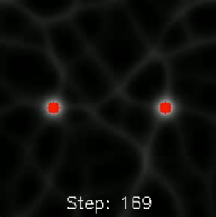 |
|  |  | 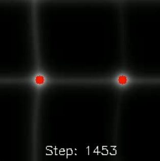 |
| 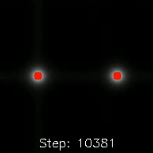 | 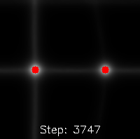 |  |

### Dense Start Simulation

Agents initialized in high density, spreading to explore and optimize paths.

|                       Step 1                        |                       Step 2                        |                       Step 3                        |                       Step 4                        |
| :-------------------------------------------------: | :-------------------------------------------------: | :-------------------------------------------------: | :-------------------------------------------------: |
| 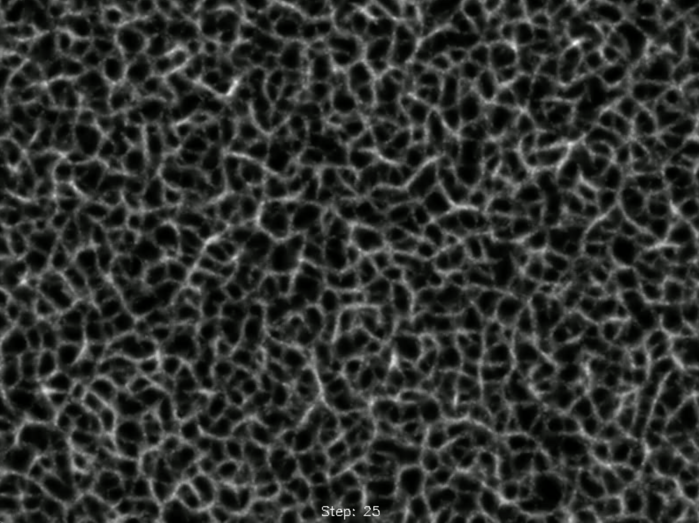  | 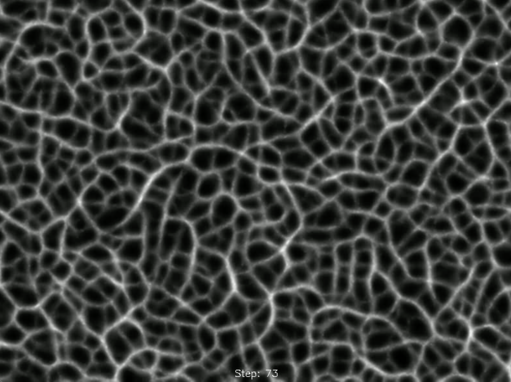 |  | 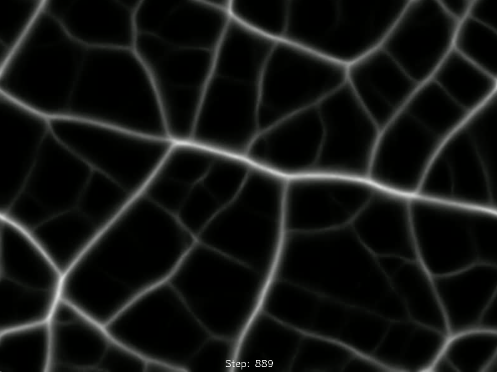 |
|  |  |  |                                                     |

### Agent Visualization

Individual agent behavior and decision-making process visualized in real-time.

|                         1                         |                         2                         |                         3                         |                         4                         |
| :-----------------------------------------------: | :-----------------------------------------------: | :-----------------------------------------------: | :-----------------------------------------------: |
|  | 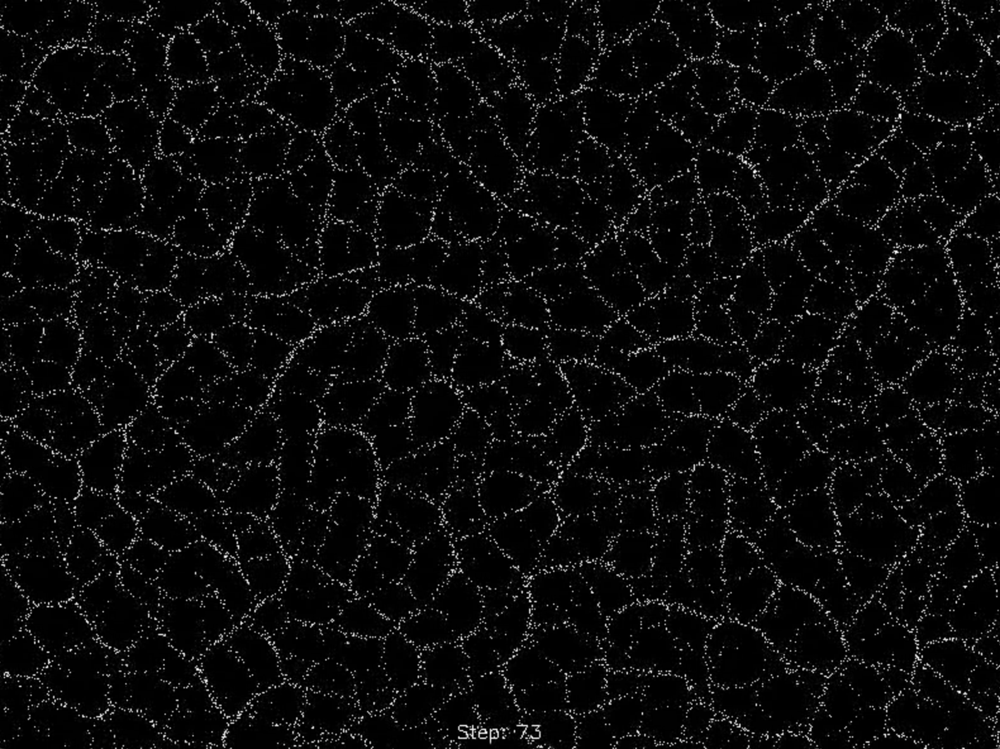 | 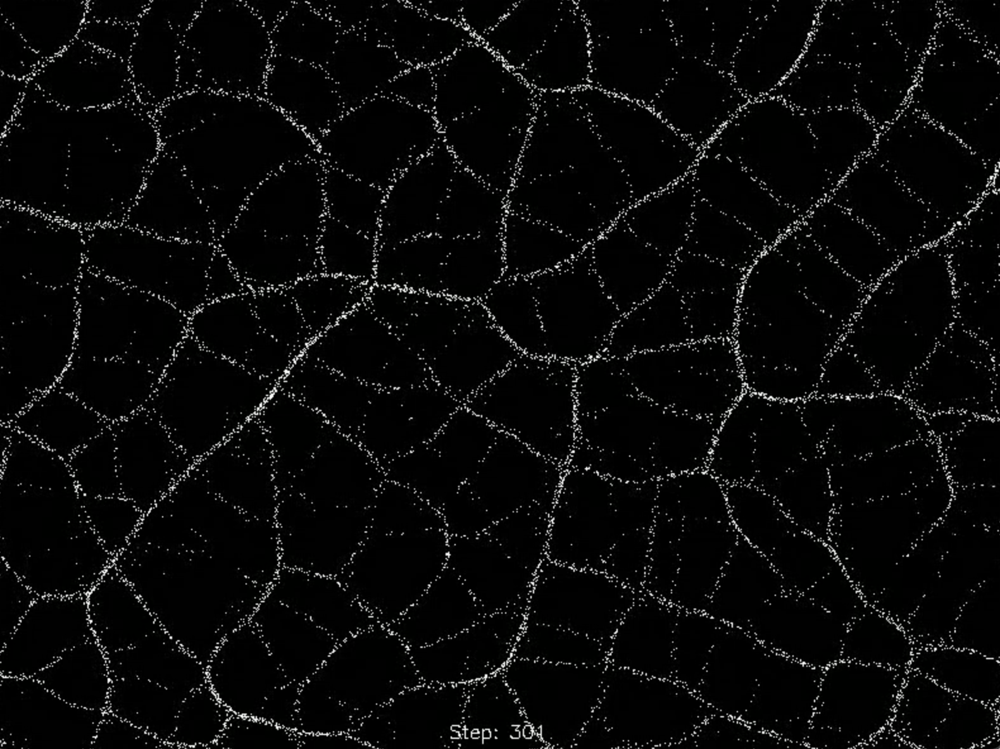 |  |
|  |  |  |                                                   |

### Parameter Experiments

Comparative analysis of different simulation configurations.

|                                                       Test 1                                                       |                                                       Test 2                                                       |                                                       Test 3                                                       |
| :----------------------------------------------------------------------------------------------------------------: | :----------------------------------------------------------------------------------------------------------------: | :----------------------------------------------------------------------------------------------------------------: |
|    | 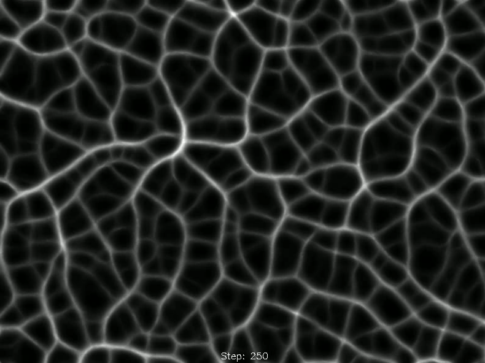 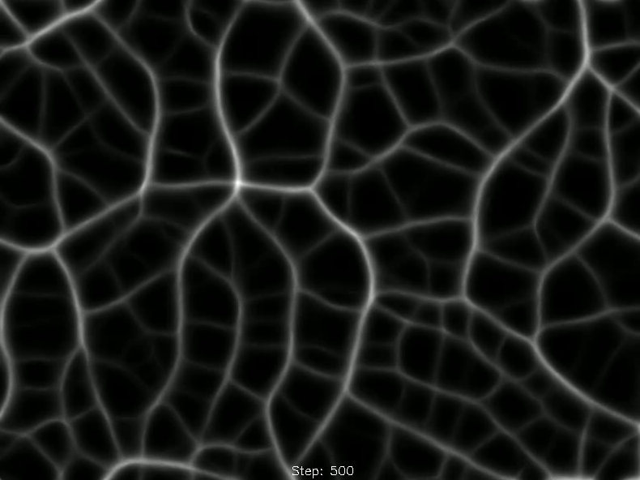  | 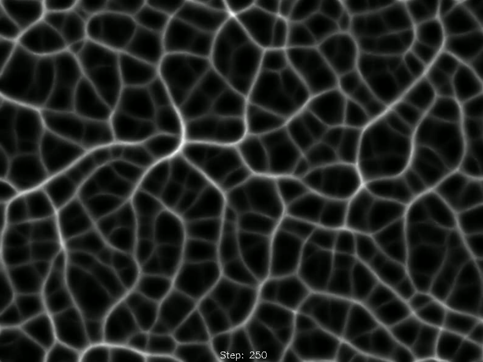   |

## Quick Start

```bash
# Create virtual environment
python -m venv .venv && source .venv/bin/activate

# Install dependencies
pip install -r requirements.txt

# Run simulation
PYTHONPATH=src python -m physarum
```

Adjust parameters with flags, or run without a window using `--headless`:

```bash
PYTHONPATH=src python -m physarum --help
```

## Project Structure

```
.
├── src/physarum/       # Simulation package
│   ├── agent.py        # Agent behavior: sense, move, deposit
│   ├── grid.py         # Grid init, stimulus, diffusion kernels
│   ├── population.py   # Agent spawning and seeding
│   ├── render.py       # Frame drawing
│   ├── simulate.py     # Step loop
│   └── cli.py          # Command-line interface
├── tests/              # Pytest suite
├── results/
│   ├── images/         # Experiment results and visualizations
│   └── benchmarks/     # Per-step timing data
├── requirements.txt
└── pyproject.toml      # Tooling configuration
```

## License

MIT — see [LICENSE](LICENSE).