# Physarum Slime Mold Simulation

A biologically-inspired optimisation algorithm that simulates the foraging behaviour of _Physarum polycephalum_ (slime mold) to solve graph-based problems like the Minimum Spanning Tree.

## Demo Videos

|                                     MST optimisation                                      |                                      Dense Start Simulation                                       |                                       Agent Visualization                                        |
| :---------------------------------------------------------------------------------------: | :-----------------------------------------------------------------------------------------------: | :----------------------------------------------------------------------------------------------: |
| [](https://youtu.be/7ZkC3MxK37Q) | [](https://youtu.be/TFyH6HfQy6c) | [](https://youtu.be/dhvJkvUcZjE) |

## Results

### Minimum Spanning Tree Experiments

Evolution of network topology as the slime mold finds optimal connections between nodes.

|                         Step 1                         |                         Step 2                         |                         Step 3                         |
| :----------------------------------------------------: | :----------------------------------------------------: | :----------------------------------------------------: |
| 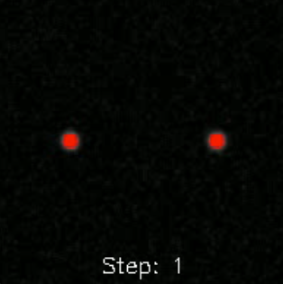 | 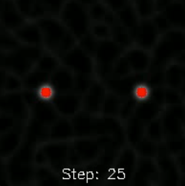 |  |
| 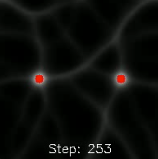 | 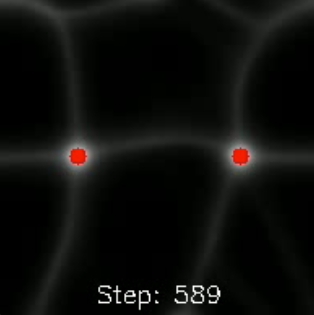 |  |
|  |                                                        |                                                        |

### Dense Start Simulation

Agents initialized in high density, spreading to explore and optimize paths.

|                       Step 1                        |                       Step 2                        |                       Step 3                        |                       Step 4                        |
| :-------------------------------------------------: | :-------------------------------------------------: | :-------------------------------------------------: | :-------------------------------------------------: |
|   |  | 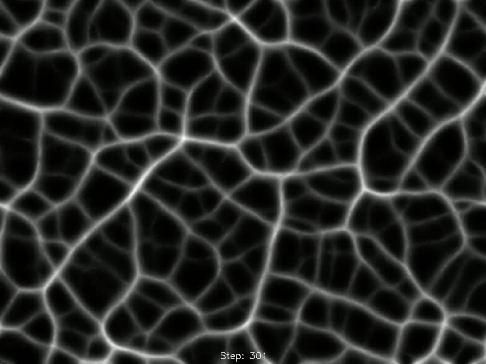 |  |
| 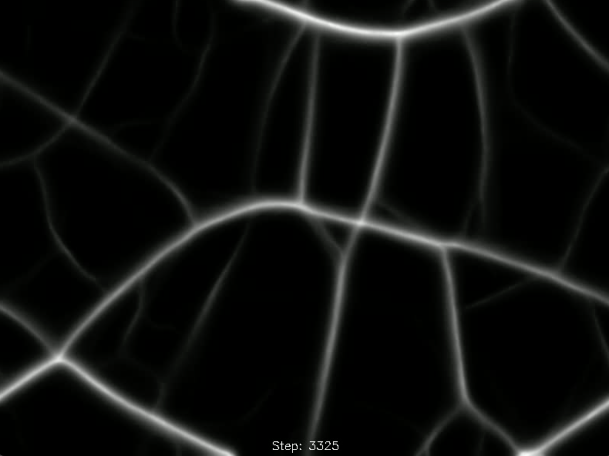 | 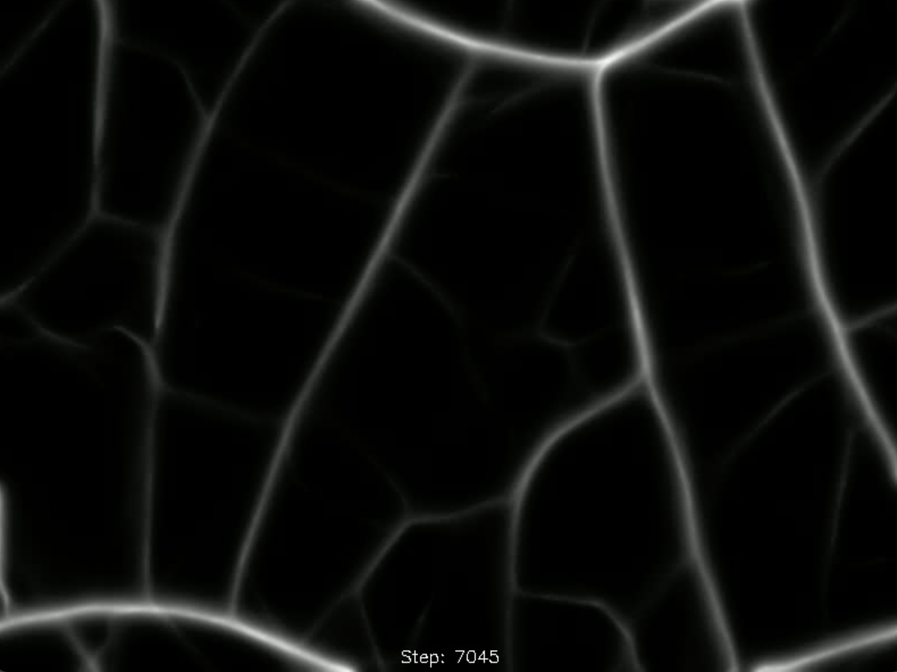 | 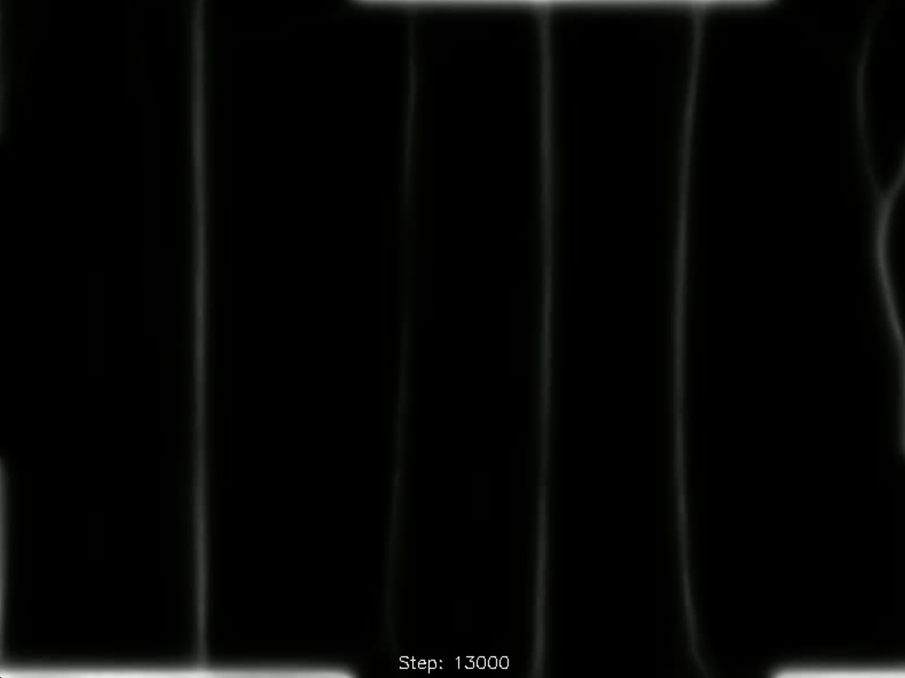 |                                                     |

### Agent Visualization

Individual agent behavior and decision-making process visualized in real-time.

|                         1                         |                         2                         |                         3                         |                         4                         |
| :-----------------------------------------------: | :-----------------------------------------------: | :-----------------------------------------------: | :-----------------------------------------------: |
| 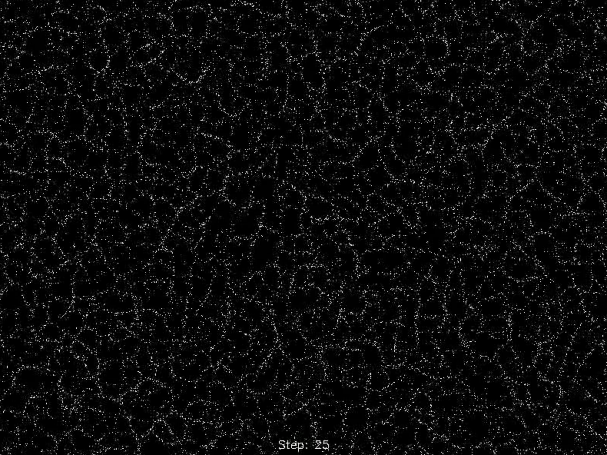 |  |  | 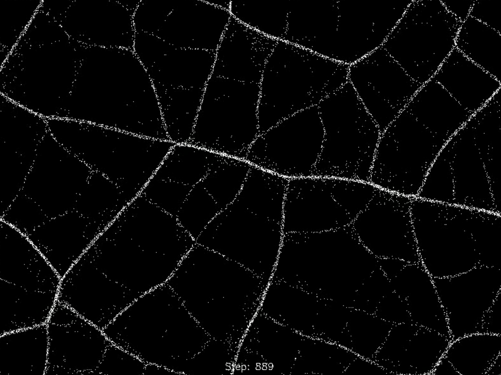 |
| 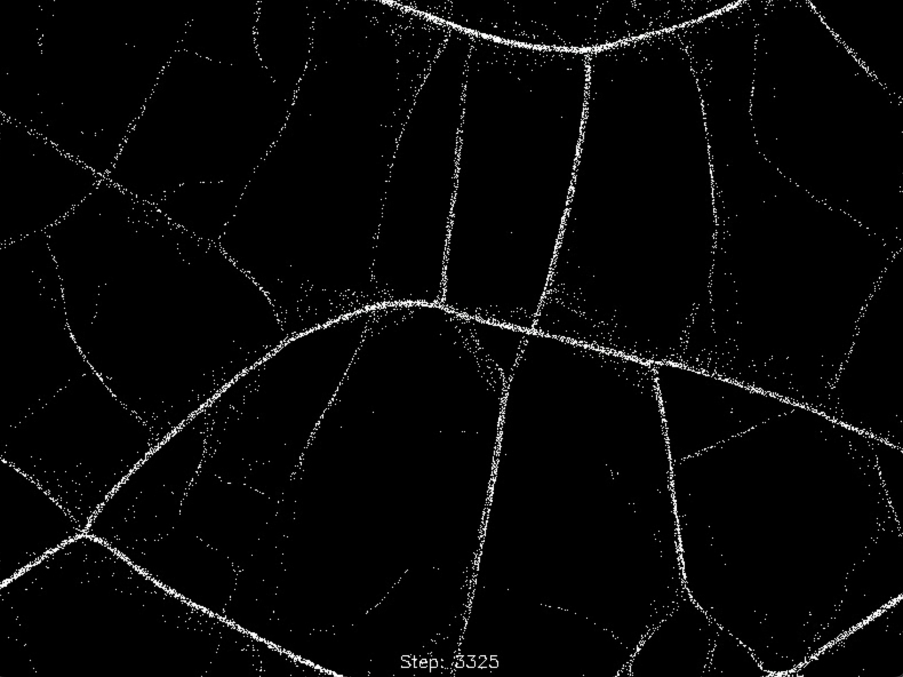 | 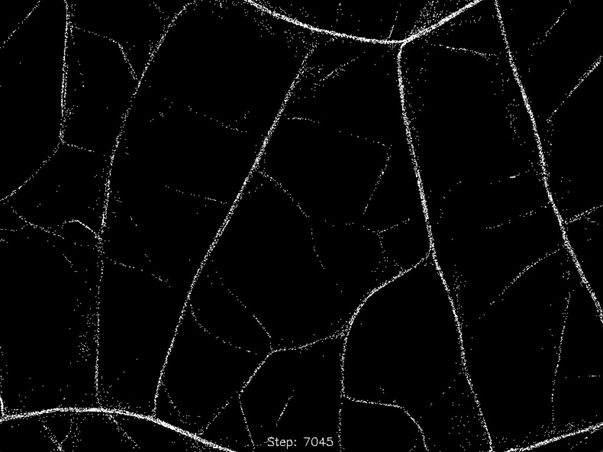 | 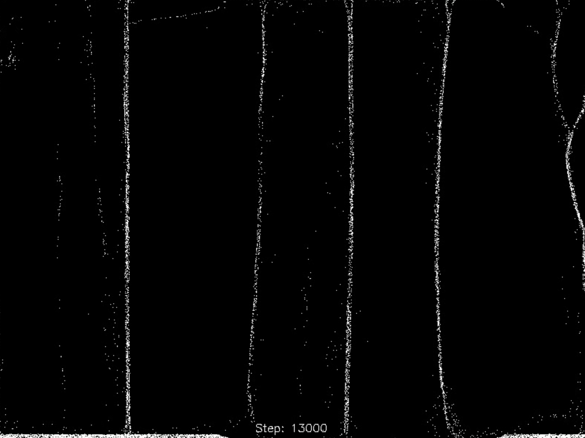 |                                                   |

### Parameter Experiments

Comparative analysis of different simulation configurations.

|                                                       Test 1                                                       |                                                       Test 2                                                       |                                                       Test 3                                                       |
| :----------------------------------------------------------------------------------------------------------------: | :----------------------------------------------------------------------------------------------------------------: | :----------------------------------------------------------------------------------------------------------------: |
| 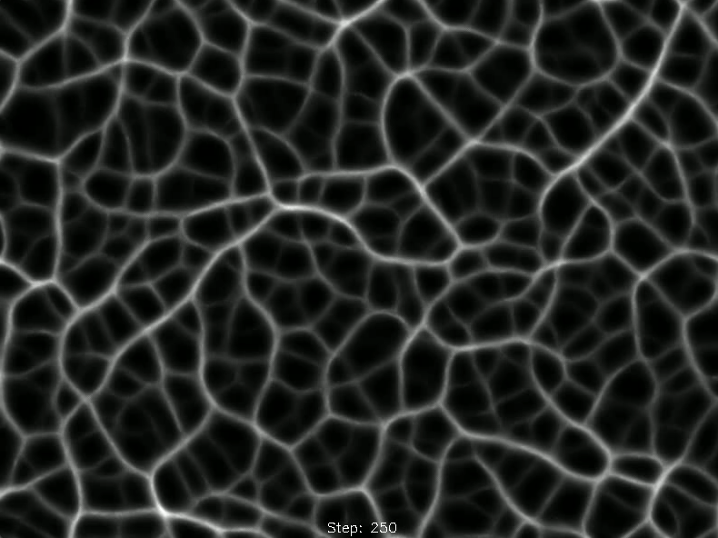 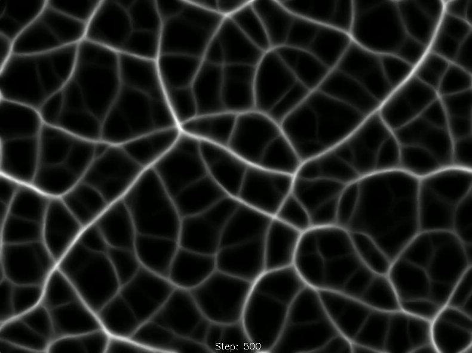 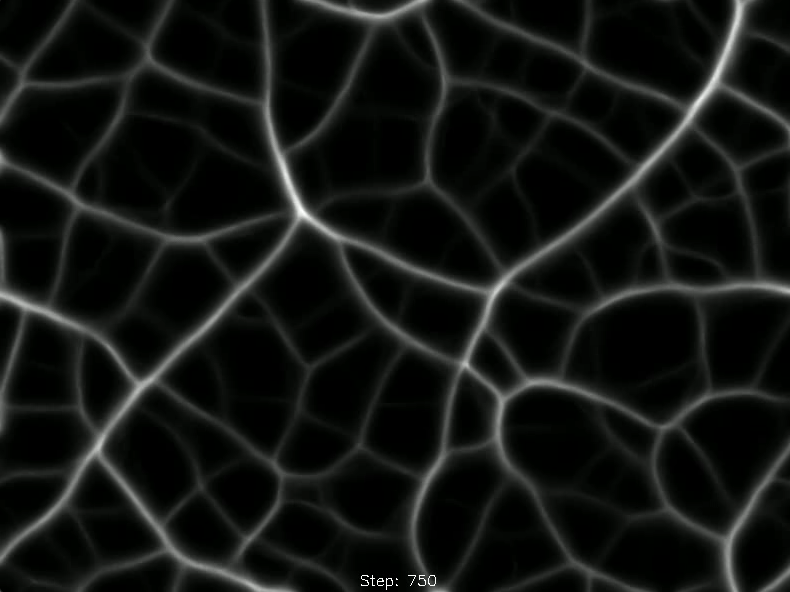 |   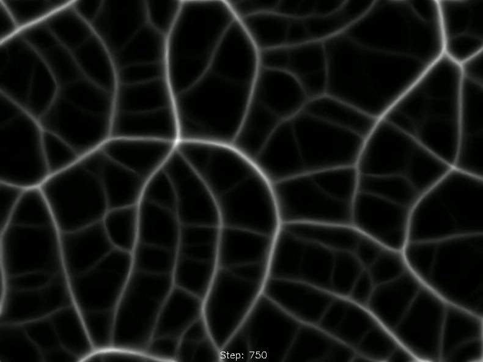 |  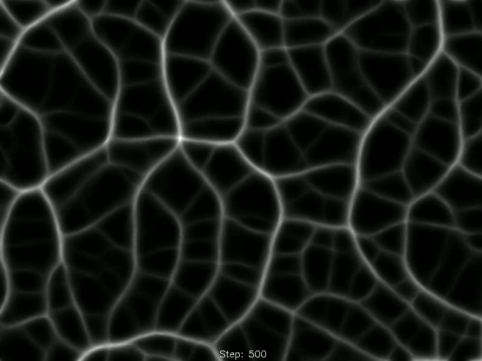 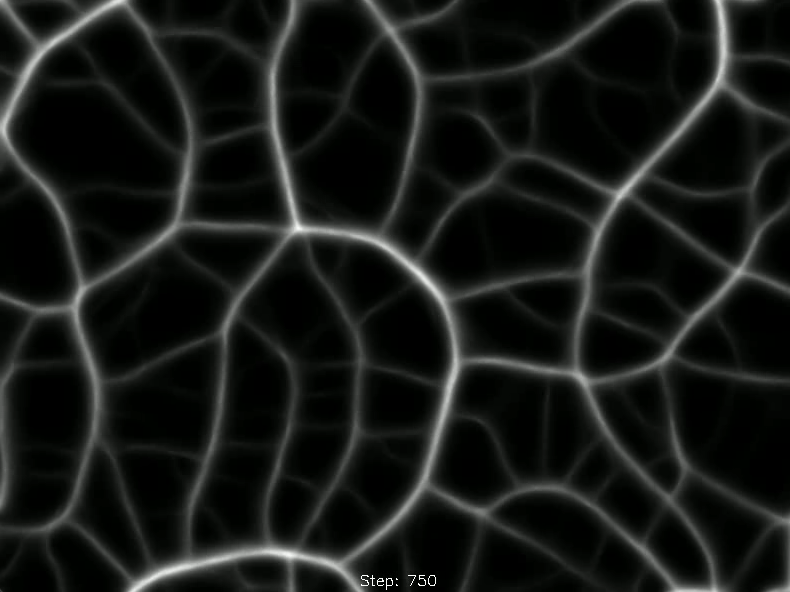 |

## Quick Start

```bash
# Create virtual environment
python -m venv .venv && source .venv/bin/activate

# Install dependencies
pip install -r requirements.txt

# Run simulation
python physarum.py
```

Modify `physarum.py` to adjust simulation parameters.

## Project Structure

```
.
├── physarum.py          # Main simulation engine
├── agent.py             # Agent behavior logic
├── requirements.txt     # Dependencies
├── Interesting_data/    # Experiment results and visualizations
│   ├── MinimumSpaningTree/   # MST optimisation experiments
│   ├── DenseStart/           # Dense initialization tests
│   ├── AgentView/            # Agent behavior visualization
│   ├── Test1-3/              # Parameter variation experiments
│   └── Gifs/                 # Animated outputs
└── cw2-2025-MiniProject(1).pdf  # Full technical report
```
